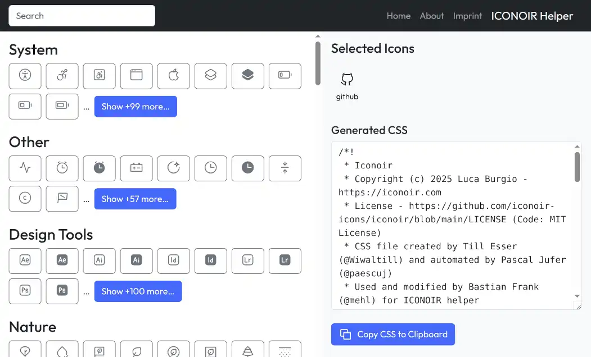

# ICONOIR Helper

Create customized CSS from iconoir icons.

I needed a customize CSS from iconoir with just a few icons for a small website, so I wrote this little tool one evening.

Just select the icons you want to use and copy the generated CSS for use in your project.

May it be useful for others.

See [ICONOIR Helper Website](https://iconoir-helper.umbrella-studios.de)

## Contact

https://bastian-frank.de  
iconoir-helper@bastian-frank.de